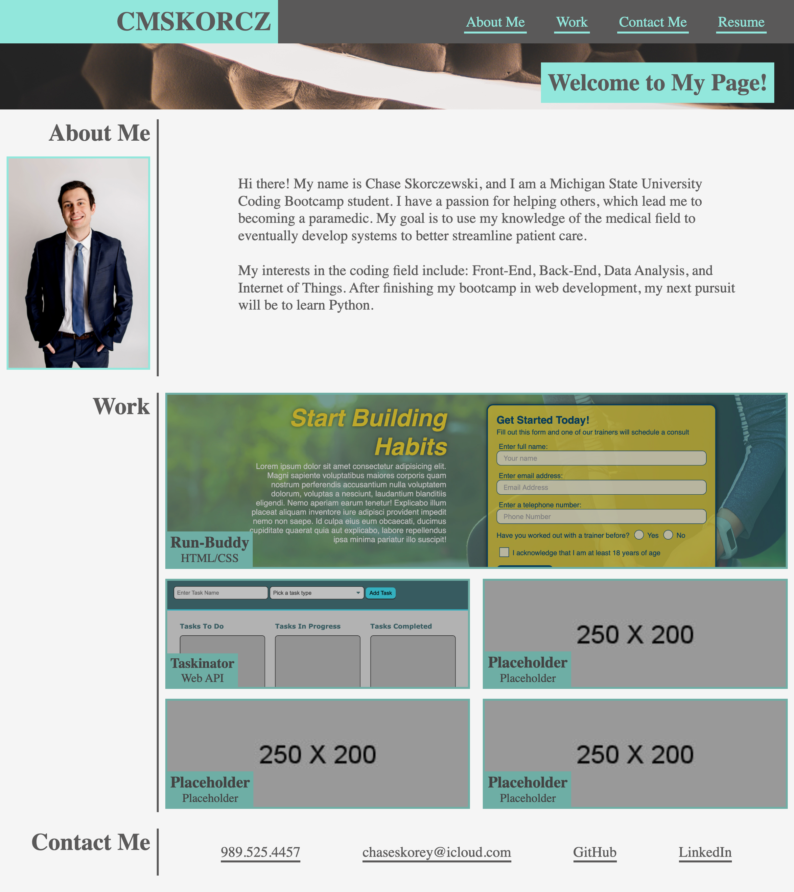

# My Portfolio Page

## Purpose
The purpose of this project was to utilize advanced CSS stylings, such as flexbox and media queries, to create a landing page that is responsive to multiple different screen sizes. Best practices utilizing `git` to build this site were also focused on, in order better familiarize myself with how these practices are implemented in larger scale projects with multiple team members.

These practices included using multiple branches to work on seperate portions of the site, with a central `develop` branch that would be merged with a `feature/...` branch. This lowers the risk of merge conflicts when multiple individuals are working on the same project, as well as prevents possibly problematic changes from being pushed directly to a deployed site's `main` branch.

This project also doubles as a portfolio page that can be continually updated to present completed projects to potential employers.

## Deployed Application
This site can be viewed at the following link: [CMSKORCZ Portfolio](https://cmskorcz.github.io/chase-skorczewski-portfolio/).

